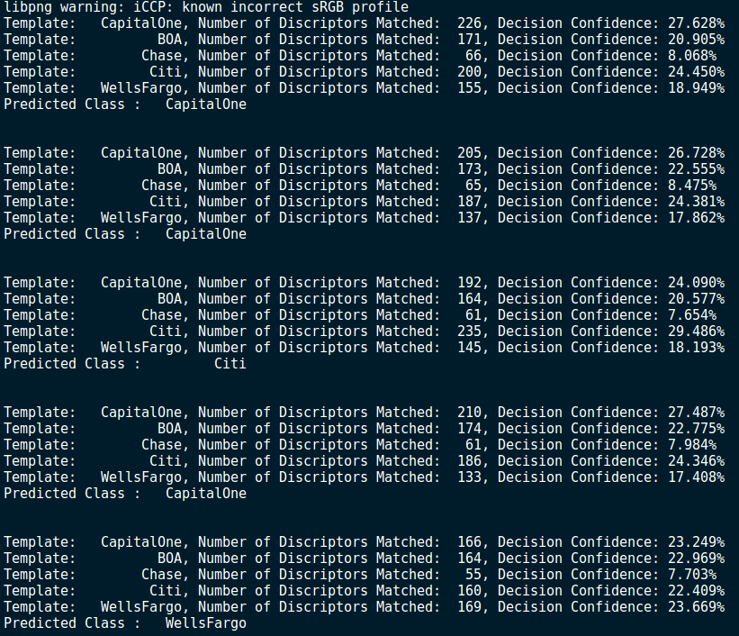
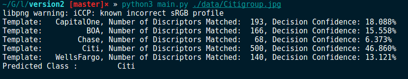

# Implementation Version 2

## Details of the implementation

> **NOTE**: Please make sure to read the `version1` for the basic idea and info about the project. This is a continuation of the same idea discussed in that version. 

Since the extraction of the keypoints and descriptors of an image is done, we are now moving on to the classification itself. The **High level** idea here will be as following:

    1 . Detect corners (e.g. Harris corner detector) - for Nike logo they are two sharp ends.
    
    2 .Compute descriptors (like SIFT - 128D integer vector)
    
    3 .On training stage remember them; on matching stage find nearest neighbours for every feature in the database obtained during training. Finally, you have a set of matches (some of them are probably wrong).
    
    4 .Seed out wrong matches using RANSAC. Thus you'll get the matrix that describes transform from ideal logo image to one where you find the logo. Depending on the settings, you could allow different kinds of transforms (just translation; translation and rotation; affine transform).

Szeliski's book has a chapter (4.1) on local features. <http://research.microsoft.com/en-us/um/people/szeliski/Book/>

Since OpenCV provides an extensive libraries, I have decided to implement the entire network using python3 version of OpenCV. 


### Signature Code and Description:

I have created model based on the the **High level** idea that is described above. Here, I will explain the signatures of my model. Please refer to the [repository](https://github.com/namanUIUC/logo_detector/tree/master/version2) for the reference code. 

```python
class Detector(object):
    def __init__(self, verbose=True):
        '''
        Detector (class) constructor.
            Args:
                verbose(bool): Indicator for log and progress bar
        '''
```

Now, to train the model the parameters needed are train images and the labels. This method will not return any arguments but it will store the learned descriptors in the heap memory `self`. 

```python
def train(self, train_images, train_labels):
        '''
        Extracting features from training images and saving it.
            Args:
                train_images (list): list of all the images (cv2)
                train_labels (list): list of all teh labels (string)
        '''
```

The match finder function is invoked while prediction to find the best possible matches given two sets of descriptors. Currently, it uses brute force but it can also handle RANSAC. 

```python
def matchFinder(self, img_des, template_des_list):
        '''
        Comparing the descriptors based on brute force.
            Args:
                des1 (list): Descriptor of an image
                des2 (list): Descriptor of an image
            Returns:
                matches(list) : sorted matche object after comparison
        '''
```

The bruteforce method is provided here which runs greedy algorithm to find the best matches.

```python
def bruteForceMatcher(self, des1, des2):
        '''
        Comparing the descriptors based on brute force.
            Args:
                des1 (list): Descriptor of an image
                des2 (list): Descriptor of an image
            Returns:
                matches(list) : sorted matche object after comparison
        '''
```

This method extracts the `key points` and `descriptors` from an image via specified method. Currently, the method we are using is `ORB`from OpenCV library. 

```python
def descExtractor(self, img):
        '''
        Extract the descriptors based on technique specified.
            Args:
                img (cv2 image): image od interest
            Returns:
                kp (list): keypoints of the image
                des(list): descriptors of the image
        '''
```

This is a helper function to read the image and make it compatible for python opencv version.

```python
def reader(self, img_path):
        '''
        Reader for the images in cv2.
            Args:
                img_path(string): path to load the data
            Returns:
                image (cv2) : loaded image in cv2
        '''
```

I have also created an Ad-Hoc version of a scoring function based on probabilities. This function assign probabilities based on the most number of matches after the matching is performed. This gives the estimate of the likelihood of the class to be the same. 

```python
def scorer(self, matches_list, num_matches):
        '''
        Ad-Hoc Scorer function
            Args:
                matches_list (list): list of all the matches correspondence
                num_matches (list): list of the total number of matches
                 with correspondence
            Return:
                probability values of the clssifier
        '''
```

The main predict function is inspired from general machine learning modules and performs similar to many libraries (like sklearn) available. 

```python
def predict(self, im_path):
        '''
        Class predictor function
            Args:
                im_path (string): path of the testing image
        '''
```

> **NOTE**: I haven't used any need learning technique to extract features. Hence, Tensorflow and PyTorch libraries are not required in this project. 

## Results



The above results are tested on validation set (images with headers). The above classification is done on all of the classes except class `others` . The model has misclassified 3 out of 5 classes (Although by very narrow margin). It is evident that the this is not a perfect classifier. Hence, there is a lot of scope of improvement.  

```
Since, python's opencv removed SIFT detector due to copy rights issue we cannot use the SIFT detector which is usually used in the descriptor and key points extration.
```


## Running the project

This version is written on python3. Here are that must be installed in your machine if you want to run :

> 1. OpenCV
> 2. Numpy
> 3. Scipy

The dependencies can be installed by following the commands :

```
cd version2
pip install -r requirements.txt
```

The snippet of the code running commands :



# References : 

1. http://research.microsoft.com/en-us/um/people/szeliski/Book/
2. https://stackoverflow.com/questions/2074956/logo-recognition-in-images
3. https://docs.opencv.org/2.4/doc/tutorials/features2d/feature_homography/feature_homography.html
4. https://stackoverflow.com/questions/2074956/logo-recognition-in-images?noredirect=1&lq=1
5. Sample Harris detector code